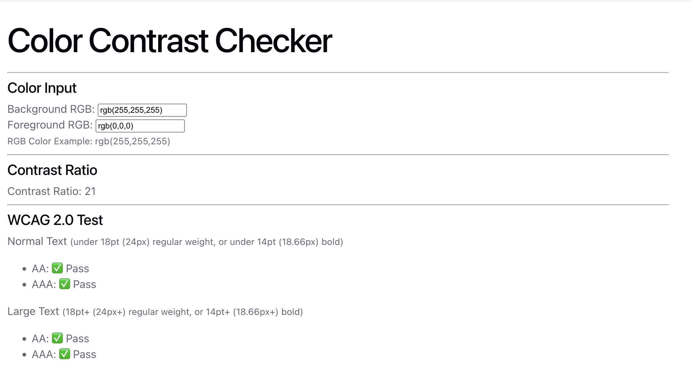

# Live Demo [here](https://color-contrast-checker.fly.dev/).

# Goal

- To understand how color contrast is calculated and the WCAG value for each color contrast.
- Inspired from [this website](https://webaim.org/resources/contrastchecker/).

# Demo



# Improvement / TODO

- Add HEX number for input.
  - Optional: swap the colour between background and foreground.
- Data input validation if allowing HEX numbere input
- Componentise App.tsx.

## Calculating Relative Luminance

Relative Luminance measures how bright a colour appears to the human eye, on a scale from `0` (black) to `1` (white).

3 steps:

1. Normalise
2. Linearize
3. Get Relative Luminance value

---

### Step 1 — Normalise RGB to a 0–1 range

Divide each channel by 255.

**Example:** `rgb(100, 180, 50)`

```
R_norm = 100 / 255 = 0.3922
G_norm = 180 / 255 = 0.7059
B_norm =  50 / 255 = 0.1961
```

---

### Step 2 — Linearize each channel

This removes the gamma curve that sRGB applies, converting back to _linear light_ values.

```ts
if (value <= 0.03928) linear = value / 12.92;
else linear = ((value + 0.055) / 1.055) ** 2.4;
```

**Example (continued):**

```
R = 0.3922 → ((0.3922 + 0.055) / 1.055) ^ 2.4 = 0.1274
G = 0.7059 → ((0.7059 + 0.055) / 1.055) ^ 2.4 = 0.4564
B = 0.1961 → ((0.1961 + 0.055) / 1.055) ^ 2.4 = 0.0300
```

---

### Step 3 — Calculate Relative Luminance

Weight each linearized channel by how sensitive the human eye is to it.

```
L = 0.2126 × R + 0.7152 × G + 0.0722 × B
```

Green has the highest weight because our eyes are most sensitive to green light.

**Example (continued):**

```
L = (0.2126 × 0.1274) + (0.7152 × 0.4564) + (0.0722 × 0.0300)
L = 0.0271 + 0.3264 + 0.0022
L = 0.3557
```

A luminance of ~0.36 — a mid-brightness colour leaning darker.

## Calculating Contrast Ratio

Scale: `1:1` (identical) → `21:1` (black vs white).

### Formula

```
ratio = (L_lighter + 0.05) / (L_darker + 0.05)
```

- `L_lighter` — higher luminance
- `L_darker` — lower luminance
- `0.05` — prevents division by zero when `L = 0`

### Example

`rgb(100, 180, 50)` on white:

```
L_fg    = 0.3557
L_white = 1.0

ratio = (1.0 + 0.05) / (0.3557 + 0.05) = 2.59
```

---

# Mics Learning

- When comparing calculated decimal values in test, -> `toBeCloseTo()`
- Another standard to check color contrast test is APCA, [checker here](https://polypane.app/color-contrast/#fg=%23107db5&bg=%23fff&level=aa&format=rgb&algo=APCA&filter=none).
- `brew install gh` and used `gh repo clone color-contrast-checker` to clone this repo to my local.

**Important**

- Used fly.io to deploy this app and used Docker to build the image, just for learning.
- Create a Dockerfile and .dockerignore
- `brew install flyctl`
- `fly launch`
- `docker build -t color-contrast-checker .`
- `npm run build`
- `fly deploy` - every time after I made a change, I can run this to deploy to prod.
- Right click at Dockerfile to build image, and run the container. Go to Docker container and click to see staging.
